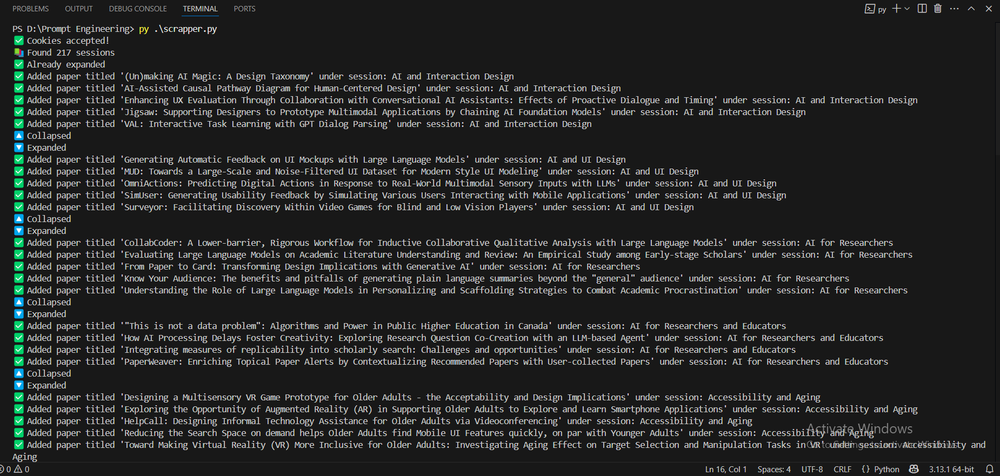

# 📄 CHI-PromptExtraction

This project is part of a research effort focused on understanding **how CHI 2024 authors use generative AI tools like ChatGPT and GPT-4**, particularly analyzing the prompts they disclose in their papers.

🔍 The goal is to crawl through CHI 2024 papers, extract metadata (session, title, link), and build a dataset of papers that can later be analyzed for prompt usage disclosures.

---

## 📂 Repository Contents

### `scrapper.py`
A standalone Python script that automates:
- Accessing the [CHI 2024 Proceedings](https://dl.acm.org/doi/proceedings/10.1145/3613904)
- Accepting cookies automatically
- Expanding each session tab
- Collecting the title, session, and paper URL for each listed paper
- Saving all the data into a `papers_CHI24.csv` file
  
#### 🔧 Requirements

Before running the script, make sure you have the following installed:

##### 📦 Python Libraries
- `selenium` – For browser automation
- `undetected-chromedriver` – To bypass bot detection on ACM’s site
- `pandas` – For data handling and CSV export

##### ✅ Installation Command

Use the following pip command to install all dependencies:

```bash
pip install selenium undetected-chromedriver pandas
```

#### ⚠️ Challenges Faced

- **Dynamic Elements:** ACM uses expandable sections with `aria-expanded`, requiring careful handling to expand/collapse sessions.
- **Bot Protection:** Traditional drivers were blocked; we used `undetected-chromedriver` to work around this.
- **State Tracking:** Determining which session is currently expanded required logic to distinguish visually open elements via class selectors.

#### 🧪 Sample Logs (Execution Preview)



#### 💾 Output

The script generates a CSV file including the session, title, and paper link for each entry.
